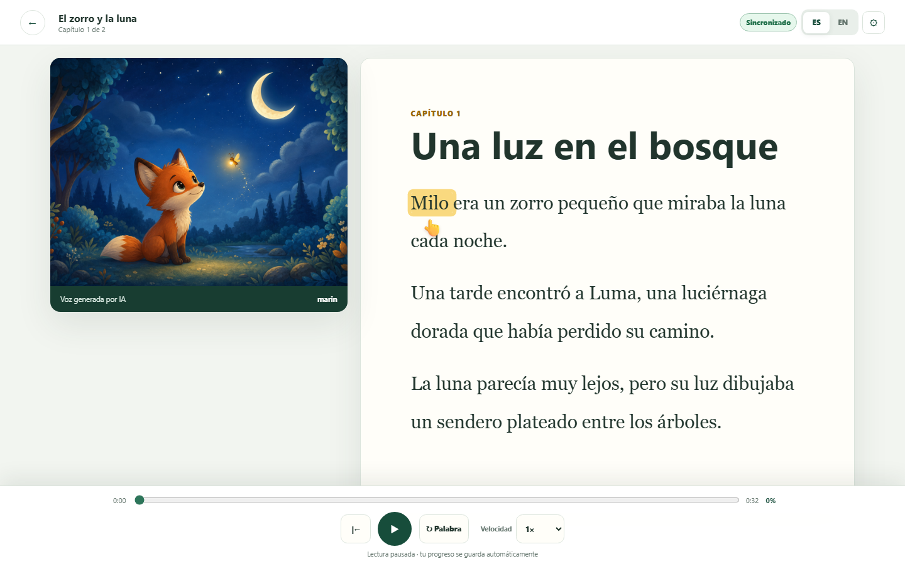
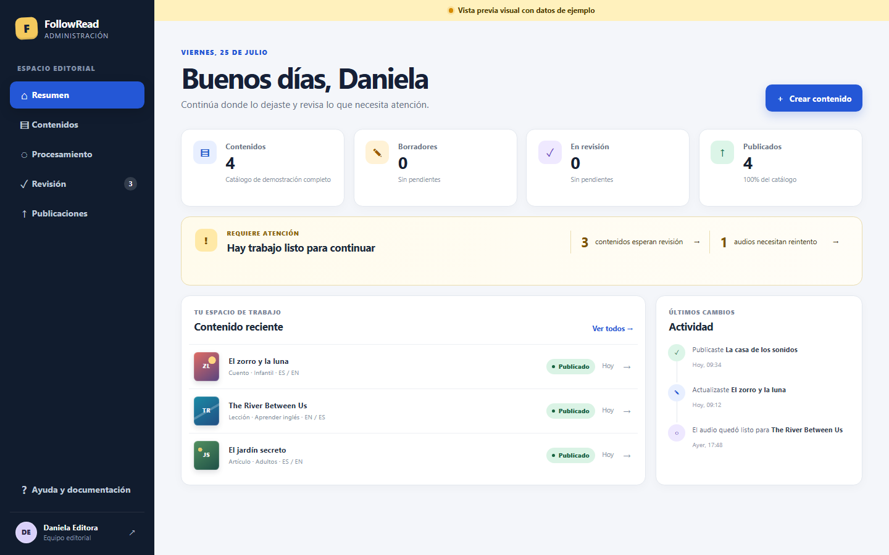
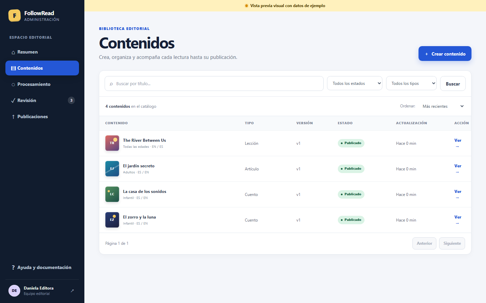

# FollowRead

[](https://github.com/dafermen/FollowRead/actions/workflows/ci.yml)
[](LICENSE)
[](https://nodejs.org/)
[](https://www.python.org/)

FollowRead is an accessible bilingual reading platform that combines synchronized narration,
word-by-word highlighting, offline reading, learning tools, and a complete editorial workflow.

It includes three independent applications:

- **Reader:** a responsive web/PWA experience for children, adults, and English learners;
- **Admin:** an editorial workspace for bilingual content, illustrations, audio, review, and
  publishing;
- **API:** a FastAPI backend with SQLite, secure sessions, catalog delivery, audio processing, and
  offline packages.

## Product tour

### Reader library

The library provides search, categories, language and reading-level filters, favorites, history,
downloads, and four complete bilingual demo readings.


### Synchronized reading

Narration follows the published timeline, highlights the active word without moving the paragraph,
and places a pointing hand below it. Readers can switch chapters, languages, speed, and reading
modes.



### Editorial administration

Admin exposes the full content lifecycle: dashboard, bilingual editor, illustration management,
audio processing, review, publication, and audit visibility.



<details>
<summary>View the editorial catalog</summary>



</details>

## Highlights

- Spanish and English content with two chapters per demo reading;
- natural OpenAI narration with persistent audio reuse, plus a credential-free local adapter;
- word-level synchronization, chapter illustrations, progress, vocabulary, and learning mode;
- offline-first PWA packages with checksums and IndexedDB persistence;
- Android and iOS Capacitor projects without sensitive native permissions;
- editorial roles, secure opaque sessions, audit events, metrics, and structured errors;
- accessibility, security, load, regression, and deployment validation;
- reproducible CI, Docker definitions, backup/restore, release, and rollback tooling.

## Demo catalog

`pnpm demo:seed` creates or updates the complete catalog idempotently:

- **The Fox and the Moon / El zorro y la luna** — story;
- **The River Between Us / El río entre nosotros** — lesson;
- **The Secret Garden / El jardín secreto** — article;
- **The House of Sounds / La casa de los sonidos** — story.

Each item is published in Spanish and English with two chapters. With the local adapter, the seed
uses deterministic simulated timings. When OpenAI is configured, it generates natural narration
once and reuses the cached MP3 files until the text or voice configuration changes.

## Architecture

```text
FollowRead
├── apps/
│   ├── admin-web/       React/Vite editorial application
│   ├── reader/          React/Vite PWA and Capacitor projects
│   └── api/             FastAPI, SQLAlchemy, Alembic, and SQLite
├── packages/            Shared contracts, UI, validation, and Reader Engine
├── infrastructure/      Database, Docker, AWS, and deployment definitions
├── scripts/             Cross-platform development and quality commands
├── docs/                Architecture, product, testing, and operations documentation
└── test/                Cross-cutting test inventory and shared fixtures
```

The Reader and Admin are separate applications. Cloud integrations are isolated behind API
adapters, and SQLite remains the authoritative persistence layer for this MVP.

## Technology

- Node.js 24 and pnpm 11;
- TypeScript, React, and Vite;
- Python 3.12, FastAPI, SQLAlchemy, and Alembic;
- SQLite for the MVP;
- Vitest, Pytest, Ruff, mypy, ESLint, and Prettier;
- Capacitor 8 for Android and iOS packaging;
- optional OpenAI text-to-speech and word alignment.

## Windows setup

Install Node.js 24, Python 3.12, and Git. Then install the pnpm version used by the repository:

```powershell
npm install --global pnpm@11.9.0
```

Open a new PowerShell window:

```powershell
cd C:\Projects\FollowRead
pnpm setup
pnpm migrate
pnpm demo:seed
pnpm check
```

`pnpm setup` installs JavaScript dependencies, creates `apps/api/.venv`, installs the API, and
configures the Git hooks. SQLite is created under `var/` and is ignored by Git.

If PowerShell blocks `pnpm.ps1`, use `pnpm.cmd` instead.

## Run the complete platform

One command starts all three applications:

```powershell
pnpm dev
```

| Application       | URL                          |
| ----------------- | ---------------------------- |
| Reader            | <http://localhost:5174>      |
| Admin             | <http://localhost:5173>      |
| API documentation | <http://localhost:8000/docs> |

Press `Ctrl+C` to stop them together.

## Optional OpenAI narration

Copy the backend environment template:

```powershell
Copy-Item apps/api/.env.example apps/api/.env
```

Configure only the local backend file:

```dotenv
FOLLOWREAD_POLLY_PROVIDER=openai
OPENAI_API_KEY=your_key_here
```

Restart `pnpm dev` and run `pnpm demo:seed`, or generate audio through **Admin → Processing**. The
recommended voices are `marin` for Spanish and `cedar` for English.

Never expose the API key through a `VITE_*` variable or commit `apps/api/.env`.

## Quality and testing

The complete local quality gate is:

```powershell
pnpm check
```

Useful focused commands:

```powershell
pnpm reader:e2e
pnpm reader:offline-e2e
pnpm quality:regression
pnpm security:audit
pnpm deploy:validate
```

Before an external deployment, all thirteen categories in
[`docs/testing/PRE_DEPLOYMENT_TESTS.md`](docs/testing/PRE_DEPLOYMENT_TESTS.md) must be `PASS` or
have an explicitly approved exception.

To regenerate the screenshots in this README while the services are active:

```powershell
pnpm screenshots:readme
```

## Documentation

Start with:

- [Architecture](docs/ARCHITECTURE.md)
- [API](docs/API.md)
- [Development](docs/DEVELOPMENT.md)
- [Testing](docs/TESTING.md)
- [Deployment](docs/DEPLOYMENT.md)
- [Operations](docs/OPERATIONS.md)
- [Security](docs/SECURITY.md)
- [Troubleshooting](docs/TROUBLESHOOTING.md)
- [Original master project prompt — English PDF](docs/FollowRead%20Project%20Prompt.pdf)
- [Current project status](CURRENT_STATUS.md)

Future Codex sessions must read [`AGENTS.md`](AGENTS.md) and
[`CURRENT_STATUS.md`](CURRENT_STATUS.md) before changing the project.

## License

FollowRead's original code and assets are available under the [MIT License](LICENSE). Third-party
components remain subject to their own licenses; see [THIRD_PARTY_LICENSES.md](THIRD_PARTY_LICENSES.md).
