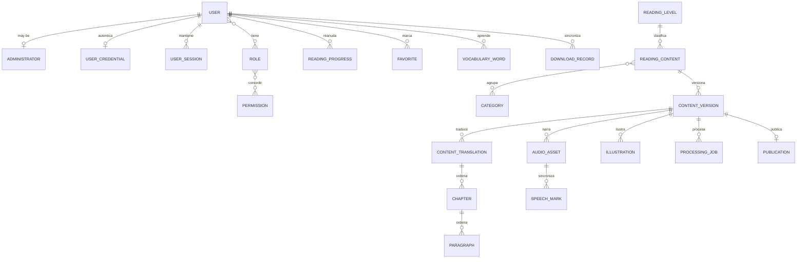

# FollowRead Data Model

**Phase:** 3  
**Task:** FR-PH03-TASK-001  
**Status:** Validated for initial implementation

## Principles

1. `ReadingContent` preserves the established identity; `ContentVersion` contains what is publishable.
2. A published version is immutable. Any correction creates the next version number.
3. Text, translations, resources, and trademarks belong to a specific version.
4. Reader only receives active, compatible, and intact publications.
5. Remote reading data requires a `User`; the local child profile does not create PII.
6. Services control transactions and states; HTTP routes do not perform commits.
7. UUID, UTC, and explicit names maintain future compatibility with PostgreSQL.
8. Editorial deletion is logical via states; audit is not cascade-deleted.

## Aggregates

| Aggregate | Root | Entities |
|---|---|---|
| Identity | `User` | `Administrator`, `Role`, `Permission`, `UserCredential`, `UserSession` |
| Editorial content | `ReadingContent` | `ReadingLevel`, `Category`, `ContentVersion`, `ContentTranslation`, `Chapter`, `Paragraph`, `Publication` |
| Resources and processing | `ContentVersion` | `AudioAsset`, `SpeechMark`, `Illustration`, `ProcessingJob` |
| Reading | `User` | `ReadingProgress`, `Favorite`, `VocabularyWord`, `DownloadRecord` |
| Audit | `AuditLog` | references actors and targets without depending on their cascades |

The join tables `user_roles`, `role_permissions`, and `content_categories` are relational details,
not new domain entities.

## Entity inventory

| Entity | Identity and ownership | Main constraints |
|---|---|---|
| `User` | Own UUID | state and external subject unique when present |
| `Administrator` | UUID and unique FK to User | a User has at most one administrative profile |
| `Role` | UUID and stable name | unique name |
| `Permission` | UUID and stable code | unique code |
| `UserCredential` | UUID and unique FK to User | separate Argon2id hash; attempts and lock non-negative |
| `UserSession` | UUID; belongs to User | unique session/CSRF hashes; ordered expiration and consistent revocation |
| `ReadingContent` | UUID stable across versions | unique `slug`; valid type and audience |
| `ContentTranslation` | UUID; belongs to ContentVersion | unique per version/language |
| `Chapter` | UUID; belongs to ContentTranslation | position and `stable_key` unique per translation |
| `Paragraph` | UUID; belongs to Chapter | position and `stable_key` unique per chapter |
| `AudioAsset` | UUID; belongs to version/language | checksum, duration, and URI; consistent version/language |
| `SpeechMark` | UUID; belongs to AudioAsset | unique index; non-negative times and offsets |
| `Illustration` | UUID; belongs to version | checksum/URI; optional editorial anchoring |
| `Category` | UUID and slug | unique slug |
| `ReadingLevel` | UUID and code | unique code and unique order |
| `ContentVersion` | UUID; belongs to ReadingContent | unique number per content; validated state |
| `Publication` | UUID; belongs uniquely to version | only one active publication per content |
| `ProcessingJob` | UUID; belongs to version/language | unique idempotent key |
| `AuditLog` | Independent UUID | optional actor; stable polymorphic target |
| `ReadingProgress` | UUID; belongs to User/content/version | unique per user and content; stable anchoring |
| `Favorite` | UUID; belongs to User/content | unique user/content pair |
| `VocabularyWord` | UUID; belongs to User/version | normalized word, language, and anchoring |
| `DownloadRecord` | UUID; belongs to User/version | unique client idempotent key |

## Controlled values

- content type: `story`, `article`, `book`, `lesson`;
- audience: `children`, `teenager`, `adult`, `all`;
- language: `en`, `es`;
- level: `beginner`, `elementary`, `intermediate`, `upper-intermediate`, `advanced`;
- editorial state: `draft`, `ready_for_processing`, `processing`, `processing_failed`,
  `ready_for_review`, `review_rejected`, `approved`, `published`, `unpublished`, `archived`;
- work: `queued`, `running`, `succeeded`, `failed`, `cancelled`;
- resource: `pending`, `ready`, `invalid`, `archived`;
- download: `requested`, `downloaded`, `verified`, `removed`, `failed`.

`ReadingLevel` is materialized as a reference table to preserve metadata and order; its code
continues to reject any value outside the above set.

## Relationships

## Editorial invariants

1. `ReadingContent.slug` does not change when creating versions.
2. The version number starts at 1 and increases without reusing values.
3. `ContentTranslation.language` only allows `en` or `es`.
4. Chapters and paragraphs are ordered with non-negative integers and stable keys.
5. A published text is not updated in place.
6. `Publication` only points to a `published` version.
7. At most one active publication exists per `ReadingContent`.
8. `AudioAsset.language` must exist as a translation of the same version.
9. Each `SpeechMark` references the audio and, when applicable, the paragraph of that same version.
10. A repeated `ProcessingJob.idempotency_key` returns the existing work.
11. Every editorial transition generates `AuditLog`.
12. The catalog filters by active publication, checksum present, and minimum compatible version.

Rules 5 through 12 require service and transaction validation; SQLite cannot express them all
via a single-row constraint.

## Identity and privacy

- `UserCredential` stores only the Argon2id hash, the change date, and the minimal attempts/lock state; it never contains the password.
- `UserSession` stores only SHA-256 hashes of the opaque token and the CSRF token. The value the browser receives cannot be reconstructed from SQLite.
- The session expires after 30 minutes of inactivity or 8 absolute hours and supports explicit revocation.
- Login endpoints and execution authorization will be completed during Phase 4.
- `Administrator` represents the editorial profile of a `User`.
- A minor uses a local, non-identifiable profile; no child `User` is created in the MVP.
- Progress, favorites, and vocabulary may live only on the device. If synchronized,
  they belong to an authorized account.
- `AuditLog.metadata` cannot contain full editorial text, tokens, free email, or signed URLs.

## Deletion and retention

| Relationship | Policy |
|---|---|
| ReadingContent -> versions | `RESTRICT`; archive instead of delete |
| Draft version -> translations/resources | `CASCADE` only before publication |
| Translation -> chapters -> paragraphs | `CASCADE` within unpublished version |
| Audio -> Speech Marks | `CASCADE` within unpublished version |
| User -> reading preferences | `CASCADE` after authorized deletion flow |
| User -> credential/sessions | `CASCADE`; revoke sessions before deleting account |
| User/content -> AuditLog | `SET NULL` for actor; target is preserved as text/UUID |
| Role/Permission assignments | `RESTRICT` while associations exist |

Services reject physical deletion of published content, publications, and audited evidence.

## SQLite/PostgreSQL compatibility

- UUID uses SQLAlchemy's portable type: native UUID when available and text representation in SQLite.
- Dates are generated in UTC; SQLite persists them as `DATETIME`, PostgreSQL may use `TIMESTAMPTZ`.
- Booleans use SQLAlchemy's portable type.
- Small metadata uses portable JSON; it is not queried with specific operators.
- Enums are stored as strings with `CHECK`, not as a native enum.
- SQLite foreign keys are enabled per connection.
- Arrays, sequences, network types, and specific extensions are not used.

## Traceability

| Rule/requirement | Application |
|---|---|
| FR-BR-001..005 | ContentVersion, Publication, AuditLog and transition services |
| FR-BR-006 | ContentTranslation, AudioAsset and SpeechMark |
| FR-BR-009..010 | ReadingProgress and `stable_key` |
| FR-BR-014..017 | enums, ReadingLevel and ContentTranslation |
| FR-BR-018 | Optional User; child profile local only |
| FR-BR-019..020 | ProcessingJob, Publication and services |
| FR-BR-021..023 | ContentVersion and DownloadRecord |
| FR-CONTENT-001..007 | complete editorial aggregate |
| FR-API-003..006 | repositories, services and Phase 3 routes |

## Persistence contracts

- `SqlAlchemyRepository` offers create, lookup by UUID, and deletion without committing transactions.
- `PublishedCatalogRepository` only returns active publications whose version is published and contains a checksum and package URL.
- `CatalogFilters` centralizes language, type, audience, level, category, limit, and offset.
- The list returns items and total before pagination; the detail loads level, categories,
  translations, chapters, and paragraphs.
- `SqlAlchemyUnitOfWork` shares a session among repositories. Use cases explicitly call `commit`;
  when exiting the context a defensive rollback and close are always executed.

## Design validation

- Prompt entities covered: 22 of 22.
- Rules FR-BR-001..025 with explicit location or future phase: PASS.
- Dependency on Docker/PostgreSQL: none for the MVP.
- Credentials/sessions modeled according to FR-DEC-014: PASS.
- Deletion of publications or audit by cascade: none.
