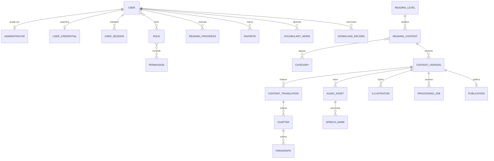

# Modelo de datos de FollowRead

**Fase:** 3  
**Tarea:** FR-PH03-TASK-001  
**Estado:** Validado para implementación inicial

## Principios

1. `ReadingContent` conserva la identidad estable; `ContentVersion` contiene lo publicable.
2. Una versión publicada es inmutable. Toda corrección crea el siguiente número de versión.
3. Texto, traducciones, recursos y marcas pertenecen a una versión concreta.
4. Reader sólo recibe publicaciones activas, compatibles e íntegras.
5. Los datos de lectura remotos requieren un `User`; el perfil infantil local no crea PII.
6. Servicios controlan transacciones y estados; las rutas HTTP no hacen commits.
7. UUID, UTC y nombres explícitos mantienen compatibilidad futura con PostgreSQL.
8. Borrado editorial es lógico mediante estados; la auditoría no se elimina en cascada.

## Agregados

| Agregado | Raíz | Entidades |
|---|---|---|
| Identidad | `User` | `Administrator`, `Role`, `Permission`, `UserCredential`, `UserSession` |
| Contenido editorial | `ReadingContent` | `ReadingLevel`, `Category`, `ContentVersion`, `ContentTranslation`, `Chapter`, `Paragraph`, `Publication` |
| Recursos y procesamiento | `ContentVersion` | `AudioAsset`, `SpeechMark`, `Illustration`, `ProcessingJob` |
| Lectura | `User` | `ReadingProgress`, `Favorite`, `VocabularyWord`, `DownloadRecord` |
| Auditoría | `AuditLog` | referencia actores y objetivos sin depender de sus cascadas |

Las tablas de unión `user_roles`, `role_permissions` y `content_categories` son detalles
relacionales, no nuevas entidades de dominio.

## Inventario de entidades

| Entidad | Identidad y propiedad | Restricciones principales |
|---|---|---|
| `User` | UUID propio | estado y sujeto externo únicos cuando existan |
| `Administrator` | UUID y FK única a User | un User tiene como máximo un perfil administrativo |
| `Role` | UUID y nombre estable | nombre único |
| `Permission` | UUID y código estable | código único |
| `UserCredential` | UUID y FK única a User | hash Argon2id separado; intentos y bloqueo no negativos |
| `UserSession` | UUID; pertenece a User | hashes únicos de sesión/CSRF; expiración ordenada y revocación consistente |
| `ReadingContent` | UUID estable entre versiones | `slug` único; tipo y audiencia válidos |
| `ContentTranslation` | UUID; pertenece a ContentVersion | único por versión/idioma |
| `Chapter` | UUID; pertenece a ContentTranslation | posición y `stable_key` únicos por traducción |
| `Paragraph` | UUID; pertenece a Chapter | posición y `stable_key` únicos por capítulo |
| `AudioAsset` | UUID; pertenece a versión/idioma | checksum, duración y URI; versión/idioma coherentes |
| `SpeechMark` | UUID; pertenece a AudioAsset | índice único; tiempos y offsets no negativos |
| `Illustration` | UUID; pertenece a versión | checksum/URI; anclaje editorial opcional |
| `Category` | UUID y slug | slug único |
| `ReadingLevel` | UUID y código | código único y orden único |
| `ContentVersion` | UUID; pertenece a ReadingContent | número único por contenido; estado validado |
| `Publication` | UUID; pertenece de forma única a versión | sólo una publicación activa por contenido |
| `ProcessingJob` | UUID; pertenece a versión/idioma | clave idempotente única |
| `AuditLog` | UUID independiente | actor opcional; objetivo polimórfico estable |
| `ReadingProgress` | UUID; pertenece a User/contenido/versión | único por usuario y contenido; anclaje estable |
| `Favorite` | UUID; pertenece a User/contenido | par usuario/contenido único |
| `VocabularyWord` | UUID; pertenece a User/versión | palabra normalizada, idioma y anclaje |
| `DownloadRecord` | UUID; pertenece a User/versión | clave idempotente del cliente única |

## Valores controlados

- tipo de contenido: `story`, `article`, `book`, `lesson`;
- audiencia: `children`, `teenager`, `adult`, `all`;
- idioma: `en`, `es`;
- nivel: `beginner`, `elementary`, `intermediate`, `upper-intermediate`, `advanced`;
- estado editorial: `draft`, `ready_for_processing`, `processing`, `processing_failed`,
  `ready_for_review`, `review_rejected`, `approved`, `published`, `unpublished`, `archived`;
- trabajo: `queued`, `running`, `succeeded`, `failed`, `cancelled`;
- recurso: `pending`, `ready`, `invalid`, `archived`;
- descarga: `requested`, `downloaded`, `verified`, `removed`, `failed`.

`ReadingLevel` se materializa como tabla de referencia para conservar metadatos y orden; su código
sigue rechazando cualquier valor fuera del conjunto anterior.

## Relaciones

## Invariantes editoriales

1. `ReadingContent.slug` no cambia al crear versiones.
2. El número de versión empieza en 1 y aumenta sin reutilizar valores.
3. `ContentTranslation.language` sólo permite `en` o `es`.
4. Capítulos y párrafos se ordenan con enteros no negativos y claves estables.
5. Un texto publicado no se actualiza en sitio.
6. `Publication` sólo apunta a una versión `published`.
7. Como máximo una publicación activa existe por `ReadingContent`.
8. `AudioAsset.language` debe existir como traducción de la misma versión.
9. Cada `SpeechMark` referencia el audio y, cuando corresponde, el párrafo de esa misma versión.
10. Un `ProcessingJob.idempotency_key` repetido devuelve el trabajo existente.
11. Toda transición editorial genera `AuditLog`.
12. El catálogo filtra por publicación activa, checksum presente y versión mínima compatible.

Las reglas 5 a 12 requieren validación de servicio y transacción; SQLite no puede expresarlas todas
mediante una restricción de una sola fila.

## Identidad y privacidad

- `UserCredential` guarda únicamente el hash Argon2id, la fecha de cambio y el estado mínimo de
  intentos/bloqueo; nunca contiene la contraseña.
- `UserSession` guarda únicamente hashes SHA-256 del token opaco y del token CSRF. El valor que
  recibe el navegador no puede reconstruirse desde SQLite.
- La sesión expira tras 30 minutos de inactividad o 8 horas absolutas y admite revocación explícita.
- Los endpoints de login y la autorización de ejecución se completan durante la Fase 4.
- `Administrator` representa el perfil editorial de un `User`.
- Un menor usa un perfil local no identificable; no se crea `User` infantil en el MVP.
- Progreso, favoritos y vocabulario pueden vivir sólo en el dispositivo. Si se sincronizan,
  pertenecen a una cuenta autorizada.
- `AuditLog.metadata` no puede contener texto editorial completo, tokens, correo libre ni URLs
  firmadas.

## Borrado y retención

| Relación | Política |
|---|---|
| ReadingContent -> versiones | `RESTRICT`; archivar en lugar de borrar |
| Versión borrador -> traducciones/recursos | `CASCADE` sólo antes de publicación |
| Traducción -> capítulos -> párrafos | `CASCADE` dentro de versión no publicada |
| Audio -> Speech Marks | `CASCADE` dentro de versión no publicada |
| User -> preferencias de lectura | `CASCADE` tras flujo autorizado de eliminación |
| User -> credencial/sesiones | `CASCADE`; revocar sesiones antes de eliminar la cuenta |
| User/contenido -> AuditLog | `SET NULL` para actor; objetivo se conserva como texto/UUID |
| Role/Permission asignados | `RESTRICT` mientras existan asociaciones |

Los servicios rechazan borrado físico de contenido publicado, publicaciones y evidencia auditada.

## Compatibilidad SQLite/PostgreSQL

- UUID usa el tipo portable de SQLAlchemy: UUID nativo cuando exista y representación de texto en
  SQLite.
- Fechas se generan en UTC; SQLite las persiste como `DATETIME`, PostgreSQL podrá usar
  `TIMESTAMPTZ`.
- Booleanos usan el tipo SQLAlchemy portable.
- Metadatos pequeños usan JSON portable; no se consultan mediante operadores específicos.
- Enums se almacenan como cadenas con `CHECK`, no como enum nativo.
- Claves foráneas SQLite se activan por conexión.
- No se usan arrays, secuencias, tipos de red ni extensiones específicas.

## Trazabilidad

| Regla/requisito | Aplicación |
|---|---|
| FR-BR-001..005 | ContentVersion, Publication, AuditLog y servicios de transición |
| FR-BR-006 | ContentTranslation, AudioAsset y SpeechMark |
| FR-BR-009..010 | ReadingProgress y `stable_key` |
| FR-BR-014..017 | enums, ReadingLevel y ContentTranslation |
| FR-BR-018 | User opcional; perfil infantil sólo local |
| FR-BR-019..020 | ProcessingJob, Publication y servicios |
| FR-BR-021..023 | ContentVersion y DownloadRecord |
| FR-CONTENT-001..007 | agregado editorial completo |
| FR-API-003..006 | repositorios, servicios y rutas de Fase 3 |

## Contratos de persistencia

- `SqlAlchemyRepository` ofrece alta, consulta por UUID y eliminación sin confirmar transacciones.
- `PublishedCatalogRepository` sólo devuelve publicaciones activas cuya versión está publicada y
  contiene checksum y URL de paquete.
- `CatalogFilters` centraliza idioma, tipo, audiencia, nivel, categoría, límite y desplazamiento.
- La lista devuelve elementos y total antes de paginar; el detalle carga nivel, categorías,
  traducciones, capítulos y párrafos.
- `SqlAlchemyUnitOfWork` comparte una sesión entre repositorios. Los casos de uso llaman `commit`
  explícitamente; al salir del contexto siempre se ejecutan rollback defensivo y cierre.

## Validación de diseño

- Entidades del prompt cubiertas: 22 de 22.
- Reglas FR-BR-001..025 con ubicación o fase futura explícita: PASS.
- Dependencia de Docker/PostgreSQL: ninguna para el MVP.
- Credenciales/sesiones modeladas según FR-DEC-014: PASS.
- Borrado de publicaciones o auditoría por cascada: no.
