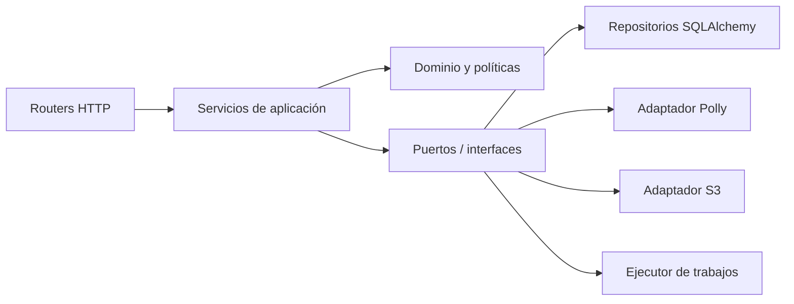

# Arquitectura inicial propuesta

**Estado:** Validada para Fase 0 - FR-PH00-TASK-009 COMPLETED.  
No autoriza crear el monorepo antes de Fase 2.

## Objetivos

- separar experiencia, reglas de negocio e infraestructura;
- mantener Reader Engine determinista y comprobable;
- cambiar contenido sin actualizar la aplicación;
- funcionar con datos locales válidos cuando la red falla;
- sustituir servicios externos por falsos en pruebas;
- permitir procesamiento asíncrono futuro sin rediseñar controladores.

## Monorepo previsto

```text
followread/
  apps/
    admin-web/
    reader/
    api/
  packages/
    shared-types/
    shared-ui/
    content-models/
    reader-engine/
    validation/
    configuration/
  infrastructure/
    docker/
    aws/
    database/
    deployment/
  docs/
  scripts/
```

## Responsabilidades y prohibiciones

### `apps/admin-web`

- Presenta flujos editoriales y consume API.
- No se empaqueta con Capacitor.
- No llama AWS, no decide transiciones por sí solo y no contiene secretos.

### `apps/reader`

- Presenta biblioteca, lector, preferencias y estado offline.
- Integra Reader Engine con audio, DOM y almacenamiento.
- No edita contenido, no llama Polly y no confía en paquetes sin validar.

### `apps/api`

- Aplica autenticación, autorización, validación y reglas de negocio.
- Coordina repositorios, servicios de dominio y adaptadores externos.
- No acopla routers HTTP directamente con SQLAlchemy, Polly o S3.

### `packages/reader-engine`

- Resuelve tiempo -> palabra/oración; controla reproducción lógica y progreso.
- No importa React, DOM, Capacitor, AWS ni una base de datos.
- Expone contratos que adaptadores de UI pueden implementar.

### Paquetes compartidos

- `shared-types`: contratos TypeScript públicos y estables.
- `shared-ui`: componentes visuales realmente compartibles entre webs.
- `content-models`: esquema de paquetes y catálogo.
- `validation`: validación portable que no sustituye al servidor.
- `configuration`: lectura tipada de configuración pública.

## Capas del backend



Los routers traducen HTTP, pero no contienen reglas ni SDKs. Los servicios coordinan transacciones.
El dominio valida estados. Los adaptadores implementan puertos y pueden reemplazarse por falsos.

## Procesamiento de audio

1. Admin envía una solicitud idempotente.
2. API valida permisos, estado, texto, idioma y voz.
3. Crea `ProcessingJob`.
4. Un ejecutor simple procesa inicialmente fuera del controlador.
5. `SpeechGenerationService` divide y envía texto a `PollyService`.
6. `SpeechMarksParser` normaliza eventos.
7. `ContentProcessingService` valida relación texto/marcas.
8. `AudioStorageService` almacena objetos.
9. La transacción final asocia recursos a la versión y cambia estado.

La interfaz de cola se diseña desde el principio, aunque Redis/Celery se agreguen después.

## Paquete de contenido

Un paquete versionado incluye manifiesto, texto estructurado, traducciones, referencias o copias
locales de audio/imágenes y Speech Marks normalizados. El manifiesto contiene checksum por objeto,
versión mínima y compatibilidad. El paquete se considera inmutable.

## Estrategia offline

- catálogo local incluido en build;
- catálogo remoto como fuente de versiones disponibles;
- descarga temporal reanudable cuando sea razonable;
- verificación antes de activación;
- puntero atómico a versión activa;
- progreso local con operaciones idempotentes;
- cola de sincronización y política de conflictos documentada.

## Datos

PostgreSQL conservará usuarios, roles, contenido, versiones, trabajos, auditoría y progreso remoto.
S3 conservará objetos grandes. Reader mantendrá sólo un subconjunto local orientado a lectura.

## Decisiones aplazadas

- herramienta de monorepo y gestor de paquetes;
- proveedor de identidad;
- Redis/Celery frente a alternativa;
- ORM o almacenamiento local de Reader;
- entrega de objetos S3;
- hosting y observabilidad.

Cada elección añadirá una dependencia sólo después de justificarla en una decisión.

## Evidencia de validación

`ARCHITECTURE_VALIDATION.md` recorre publicación, reproducción, offline y recuperación, y define
reglas de dependencia que se automatizarán cuando exista código.
