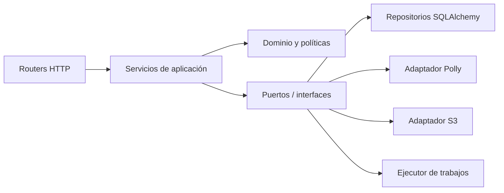

# Proposed initial architecture

**Status:** Validated for Phase 0 - FR-PH00-TASK-009 COMPLETED.  
Does not authorize creating the monorepo before Phase 2.

## Goals

- separate experience, business rules, and infrastructure;
- keep the Reader Engine deterministic and verifiable;
- change content without updating the application;
- work with valid local data when the network fails;
- replace external services with fakes in tests;
- allow future asynchronous processing without redesigning controllers.

## Planned monorepo

```text
followread/
  apps/
    admin-web/
    reader/
    api/
  packages/
    shared-types/
    shared-ui/
    content-models/
    reader-engine/
    validation/
    configuration/
  infrastructure/
    docker/
    aws/
    database/
    deployment/
  docs/
  scripts/
```

## Responsibilities and prohibitions

### `apps/admin-web`

- Presents editorial flows and consumes APIs.
- Is not packaged with Capacitor.
- Does not call AWS, does not decide transitions on its own, and does not contain secrets.

### `apps/reader`

- Presents library, reader, preferences, and offline state.
- Integrates Reader Engine with audio, DOM, and storage.
- Does not edit content, does not call Polly, and does not rely on unvetted packages.

### `apps/api`

- Applies authentication, authorization, validation, and business rules.
- Coordinates repositories, domain services, and external adapters.
- Does not couple HTTP routers directly with SQLAlchemy, Polly, or S3.

### `packages/reader-engine`

- Resolves time -> word/sentence; controls logical playback and progress.
- Does not import React, DOM, Capacitor, AWS, or a database.
- Exposes contracts that UI adapters can implement.

### Shared packages

- `shared-types`: public and stable TypeScript contracts.
- `shared-ui`: visual components truly shareable across websites.
- `content-models`: package schema and catalog.
- `validation`: portable validation that does not replace the server.
- `configuration`: typed reading of public configuration.

## Backend layers



Routers translate HTTP, but do not contain rules or SDKs. Services coordinate transactions.
The domain validates states. Adapters implement ports and can be replaced by fakes.

## Audio processing

1. Admin submits an idempotent request.
2. API validates permissions, state, text, language, and voice.
3. Creates `ProcessingJob`.
4. A simple executor initially processes outside the controller.
5. `SpeechGenerationService` splits and sends text to `PollyService`.
6. `SpeechMarksParser` normalizes events.
7. `ContentProcessingService` validates text/marks relationships.
8. `AudioStorageService` stores objects.
9. The final transaction associates resources to the version and changes state.

The queue interface is designed from the start, even if Redis/Celery are added later.

## Content package

A versioned package includes a manifest, structured text, translations, references or local copies
of audio/images, and normalized Speech Marks. The manifest contains a checksum per object,
minimum version, and compatibility. The package is considered immutable.

## Offline strategy

- local catalog included in the build;
- remote catalog as the source of available versions;
- resumable temporary download when reasonable;
- verification before activation;
- atomic pointer to the active version;
- local progress with idempotent operations;
- synchronization queue and documented conflict policy.

## Data

SQLite will store users, roles, content, versions, jobs, audit, and remote progress in the MVP.
S3 will store large objects. Reader will keep only a local read-oriented subset. SQLAlchemy and Alembic will maintain a boundary that allows migrating to PostgreSQL without changing routers or domain.

## Deferred decisions

- monorepo tool and package manager;
- identity provider;
- Redis/Celery versus alternative;
- ORM or local Reader storage;
- delivery of S3 objects;
- hosting and observability;
- timing and strategy for migrating SQLite to PostgreSQL.

Each choice will add a dependency only after it is justified in a decision.

## Validation evidence

`ARCHITECTURE_VALIDATION.md` walks through publishing, playback, offline, and recovery, and defines
dependency rules that will be automated when code exists.
