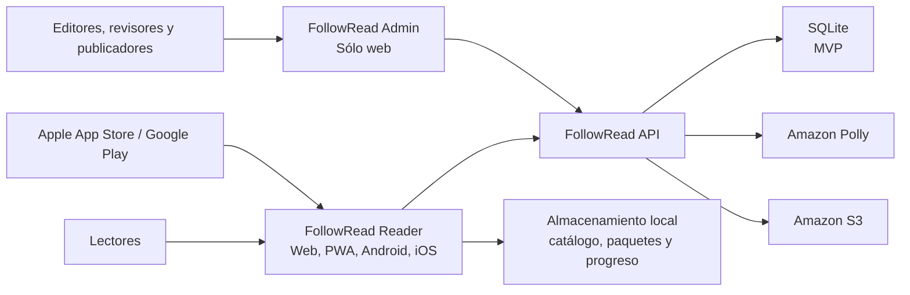

# Contexto del sistema

**Estado:** Validado para Fase 0 - FR-PH00-TASK-009 COMPLETED.

## Propósito

Este documento muestra quién usa FollowRead, qué límites controla el proyecto y qué servicios externos
requiere. No define todavía clases, tablas ni endpoints.

## Personas y sistemas externos

| Elemento | Responsabilidad o relación |
|---|---|
| Lector infantil | Consume contenido con interfaz simple y apoyo visual |
| Lector adulto | Consume contenido con controles y presentación configurables |
| Estudiante de inglés | Usa repetición, traducción y vocabulario |
| Tutor/familia/docente | Acompaña el uso; alcance de cuentas por decidir |
| Editor | Crea contenido y solicita procesamiento |
| Revisor | Valida texto, audio y sincronización |
| Publicador/administrador | Autoriza publicación y opera el sistema |
| Amazon Polly | Genera audio y Speech Marks |
| Amazon S3 | Guarda audio, imágenes y paquetes |
| SQLite | Conserva datos autoritativos y relaciones del MVP dentro del servicio API |
| Proveedor de identidad | No decidido; la primera arquitectura permite identidad propia o externa |
| Tiendas móviles | Distribuyen Reader en fases posteriores |

## Diagrama de contexto

## Límites de confianza

1. Navegadores y dispositivos son clientes no confiables.
2. API es el único límite autorizado para lógica privilegiada y AWS.
3. El archivo SQLite pertenece exclusivamente a la API y no es accesible desde clientes.
4. S3 usa acceso controlado; URLs temporales o entrega mediada se decidirán después.
5. Almacenamiento local puede dañarse o modificarse; Reader valida paquetes.

## Flujos principales

### Publicación

Admin -> API -> validación -> trabajo de procesamiento -> Polly -> S3 -> revisión -> versión publicada
-> catálogo remoto.

### Lectura

Reader -> catálogo local/remoto -> paquete compatible -> Reader Engine -> audio/temporización ->
interfaz -> progreso local/API.

### Uso offline

Reader descarga a área temporal -> valida checksum -> activa localmente -> lee sin API -> encola
progreso -> sincroniza al recuperar conexión.

## Responsabilidades fuera del sistema

- derechos y calidad editorial del contenido;
- políticas legales y consentimiento;
- gestión de cuentas de tiendas móviles;
- presupuesto y contratos del proveedor cloud.

## Resultado de validación

Personas, sistemas externos, límites de confianza y flujos fueron contrastados con los 12 casos de uso:
PASS. Ver `ARCHITECTURE_VALIDATION.md`.
