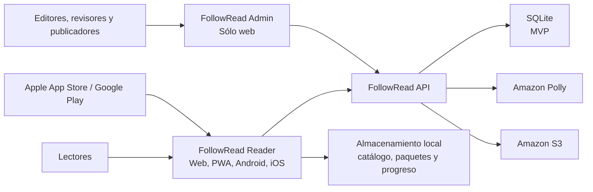

# System Context

**Status:** Validated for Phase 0 - FR-PH00-TASK-009 COMPLETED.

## Purpose

This document shows who uses FollowRead, what boundaries the project controls, and what external services it requires. It does not yet define classes, tables, or endpoints.

## People and external systems

| Element | Responsibility or relationship |
|---|---|
| Child reader | Consumes content with a simple interface and visual support |
| Adult reader | Consumes content with configurable controls and presentation |
| English learner | Uses repetition, translation, and vocabulary |
| Tutor/family/teacher | Accompanies use; account scope to be decided |
| Editor | Creates content and requests processing |
| Reviewer | Validates text, audio, and synchronization |
| Publisher/administrator | Authorizes publication and operates the system |
| Amazon Polly | Generates audio and Speech Marks |
| Amazon S3 | Stores audio, images, and packages |
| SQLite | Holds authoritative data and MVP relationships within the API service |
| Identity provider | Not decided; the initial architecture allows self or external identity |
| Mobile stores | Distribute Reader in later phases |

## Context diagram

## Trust boundaries

1. Browsers and devices are untrusted clients.
2. The API is the only authorized boundary for privileged logic and AWS.
3. The SQLite file belongs exclusively to the API and is not accessible from clients.
4. S3 uses controlled access; temporary URLs or mediated delivery will be decided later.
5. Local storage can be corrupted or modified; Reader validates packages.

## Main flows

### Publication

Admin -> API -> validation -> processing job -> Polly -> S3 -> review -> published version -> remote catalog.

### Reading

Reader -> local/remote catalog -> compatible package -> Reader Engine -> audio/timing -> interface -> local/API progress.

### Offline use

Reader downloads to a temporary area -> validates checksum -> activates locally -> reads without API -> queues progress -> syncs when connection is restored.

## Responsibilities outside the system

- editorial rights and content quality;
- legal policies and consent;
- management of mobile store accounts;
- cloud provider budget and contracts.

## Validation result

People, external systems, trust boundaries, and flows were checked against the 12 use cases: PASS. See `ARCHITECTURE_VALIDATION.md`.
