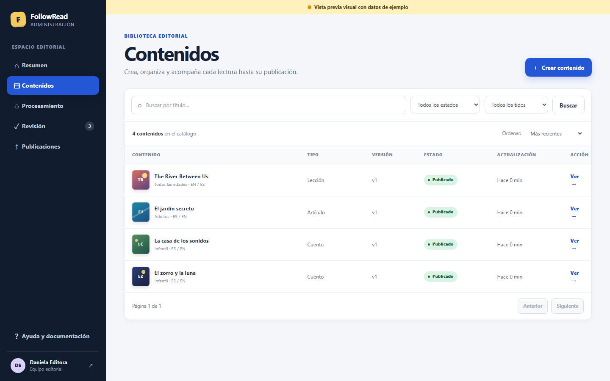

# User Guides

## Reader: choose a reading and follow the narration

Open the Reader, choose an available reading from the library and use its playback controls to follow the highlighted text. The reading view offers language and display preferences; availability of audio depends on the published catalog.

## Administrator: manage the catalog

Open `/admin/` and sign in with your authorized account. Use the dashboard and editorial catalog to review readings and their processing state. Access credentials are private and are not included in this guide.

For environment preparation and technical commands, continue with [Development](../DEVELOPMENT.md). For an unavailable reading or failed process, consult [Troubleshooting](../TROUBLESHOOTING.md).

## Persistent audio processing and VPS paths

`pnpm dev` now starts the audio worker with the other local services. After updating an
existing installation, run `pnpm migrate` and restart `pnpm dev`. Admin remains on 5173,
Reader on 5174 and the API on 8000. Audio requests return a queued job immediately;
Admin polls its progress while the worker processes it. A restarted worker preserves queued
jobs and marks interrupted running jobs as failed; review provider charges before retrying.

The planned public Reader is at `/`, Admin at `/admin/` and the API at `/api/` on
`followread.innovalogic.tech`. API interactive documentation is disabled in production;
product documentation remains at `/admin/docs/`. The VPS runbook is available in the
documentation portal under Delivery → FollowRead VPS. Publication requires owner approval.
