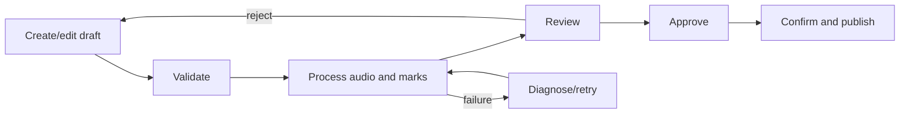
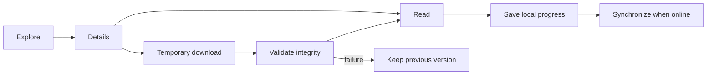
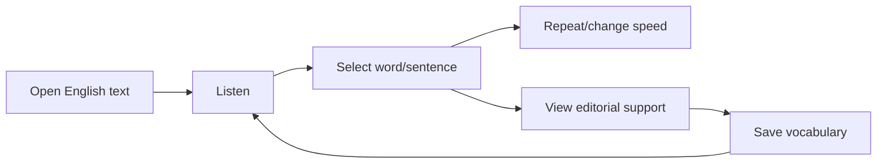

# User Flows

**Status:** Validated  
**Responsible task:** FR-PH01-TASK-002 - COMPLETED

## Main editorial flow

## Reading and offline

## Learn English

## Coverage of cases

| Case | Start | Main path | Critical alternate | Safe end |
|---|---|---|---|---|
| FR-UC-001 | list/create | edit-process-review-publish | fail/reject | version or draft |
| FR-UC-002 | detail/reader | load-play-follow-save | audio/marks/resize | progress preserved |
| FR-UC-003 | detail | download-validate-activate-read | network/checksum/space | valid version |
| FR-UC-004 | start/refresh | compare-download-migrate | incompatible/corrupt | valid catalog |
| FR-UC-005 | reader | word-repeat-translate-save | support missing/offline | position preserved |
| FR-UC-006 | privileged route | authorize-deny-audit | session expired | no effects |
| FR-UC-007 | settings | choose-preview-apply | storage/move | safe preferences |
| FR-UC-008 | editor | detect-compare-restore | conflict/corruption | no overwrite |
| FR-UC-009 | reconnection | send-validate-apply-confirm | conflict/token/resend | pending or confirmed |
| FR-UC-010 | errors | inspect-fix-retry | cost/permission/provider | evidence preserved |
| FR-UC-011 | library | merge-filter-detail | empty/incompatible/offline | content or explanation |
| FR-UC-012 | my reading | switch local-sync | duplicate/token/no account | local/confirmed data |

## Focus and announcements

- Navigation changes focus to the main heading only when appropriate.
- Dialogs return focus to their trigger.
- Auto-scroll does not move focus.
- Save, download, and sync use moderate status regions.
- Errors place focus on the summary and link to fields.

## Outcome

- 12 of 12 cases covered: PASS.
- Error, offline, permission, recovery and accessibility: PASS.
- Reader/Admin separated: PASS.
