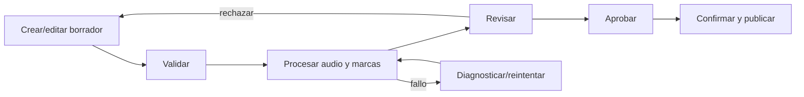
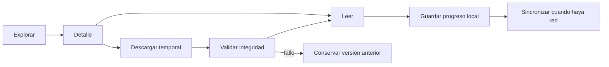
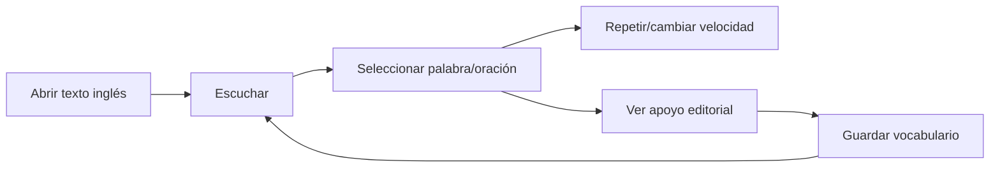

# Flujos de usuario

**Estado:** Validado  
**Tarea responsable:** FR-PH01-TASK-002 - COMPLETED

## Flujo editorial principal

## Lectura y offline

## Aprender inglés

## Cobertura de casos

| Caso | Inicio | Camino principal | Alterno crítico | Fin seguro |
|---|---|---|---|---|
| FR-UC-001 | lista/crear | editar-procesar-revisar-publicar | fallo/rechazo | versión o borrador |
| FR-UC-002 | detalle/lector | cargar-reproducir-seguir-guardar | audio/marcas/resize | progreso conservado |
| FR-UC-003 | detalle | descargar-validar-activar-leer | red/checksum/espacio | versión válida |
| FR-UC-004 | inicio/refresco | comparar-descargar-migrar | incompatible/corrupta | catálogo válido |
| FR-UC-005 | lector | palabra-repetir-traducir-guardar | apoyo ausente/offline | posición conservada |
| FR-UC-006 | ruta privilegiada | autorizar-denegar-auditar | sesión expirada | sin efectos |
| FR-UC-007 | configuración | elegir-previsualizar-aplicar | almacenamiento/movimiento | preferencias seguras |
| FR-UC-008 | editor | detectar-comparar-restaurar | conflicto/corrupción | sin sobreescritura |
| FR-UC-009 | reconexión | enviar-validar-aplicar-confirmar | conflicto/token/reenvío | pendiente o confirmado |
| FR-UC-010 | errores | inspeccionar-corregir-reintentar | costo/permiso/proveedor | evidencia conservada |
| FR-UC-011 | biblioteca | combinar-filtrar-detalle | vacío/incompatible/offline | contenido o explicación |
| FR-UC-012 | mi lectura | cambiar local-sincronizar | duplicado/token/sin cuenta | dato local/confirmado |

## Foco y anuncios

- Navegar cambia foco al encabezado principal sólo cuando corresponde.
- Diálogos devuelven foco al disparador.
- Auto-scroll no mueve foco.
- Guardado, descarga y sincronización usan regiones de estado moderadas.
- Errores colocan foco en resumen y enlazan campos.

## Resultado

- 12 de 12 casos cubiertos: PASS.
- Error, offline, permiso, recuperación y accesibilidad: PASS.
- Reader/Admin separados: PASS.
